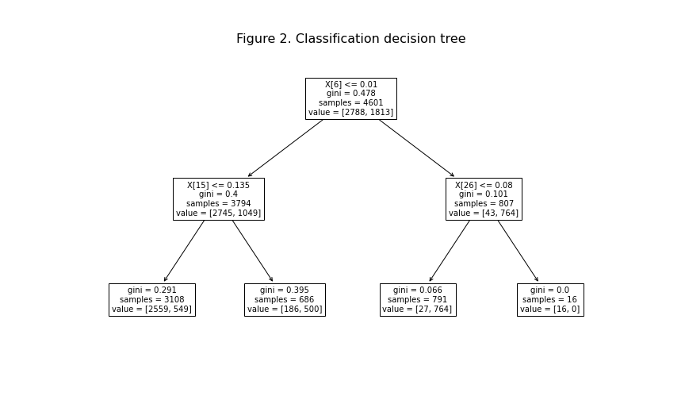

# 8. Decision trees

### What is a decision tree?

A **decision tree** is a collection of **decision nodes**, connected by branches, extending downwards from the **root node**, until terminating in the **leaf nodes**. The usual graphical representation of a decision tree puts the root on top and the leaves at the bottom, as in Figures 1 and 2, which have been created with a scikit-learn utility and saved to PNG files with the `matplotlib.pyplot` function `savefig`.

Decision trees can be used for both classification and regression purposes. A decision tree creates a partition of the data set into a collection of subsets, one for each leaf. In a predictive model based on a decision tree, the predicted target value is the same for all the samples of the same leaf. More specifically, in a decision tree regressor, the predicted target value is obtained in a straightforward way, as the average target value in that leaf. In a decision tree classifier, the predicted target value is the one that happens more frequently in that leaf.

Decision tree classifiers deserve a longer introduction. Under the hood, these classifiers predict a probability for the samples from a particular leaf node to take each target value. This predicted probability is calculated as the proportion of occurrence of that target value in the leaf. In a binary classifier, if the probability of the positive class is taken as a predictive score, the predicted class results from applying a cutoff value 0.5 to the score.

### The CART algorithm

There are various ways to extract a decision tree model from data. The top popular one is the **CART** (Classification And Regression Trees) algorithm. In scikit-learn, the subpackage `tree` provides the estimator classes `DecisionTreeRegressor` and `DecisionTreeClassifier`, both based on CART.

At every decision node, there is a `split`, based on one of the features and a cutoff. CART chooses at every node the **optimal split**. In decision tree regressors, the split search is based on a **least squares criterion**: the optimal split is the one for which the sum of squared prediction errors is minimum.

Figure 1 shows a decision tree regressor, developed to predict the sale price of a house (see the example *Assessing home values in West Roxbury*). At every node, you find the number of samples, the mean squared error and the predicted value, which is the mean target value in that leaf. The tree is optimal among those satisfying the conditions set by the arguments of `DecisionTreeRegressor` (in this case `max_depth=2`), in the sense that the sum of squared prediction errors is minimum.

In a decision tree classifier, the split search is based either on the **Gini impurity measure** (the default) or on the **entropy measure**. For every possible split, CART calculates the loss as the weighted average of the losses at the two branches, choosing the split that leads to the minimum loss.

Figure 2 is a graphical representation of a decision tree classifier used as a spam filter (see the example *The spam filter*). At every leaf, you find the number of samples, the Gini value and the number of negative and positive samples (alphabetic order) in that leaf. If there are more positive than negative samples, the predicted target for that leaf is positive. If there are more negative than positive samples, it is negative. This tree is optimal in the sense that the total Gini value (the weighted average of the Gini values of the leaf nodes) is minimum.

### Controlling the growth of the tree

Predictive models based on decision trees are prone to **overfitting**. Even with a moderate number of features, a tree whose growth is not stopped can lead to a complex model with overfitting problems. In scikit-learn, the classes `DecisionTreeRegressor` and `DecisionTreeClassifier` allow many arguments for controlling the growth of the tree: `max_depth`, `max_leaf_nodes`, `min_samples_split`, `min_samples_leaf`, `min_impurity_decrease`, etc. Only the first two will appear in these notes:

* The **depth** of a tree is the number of nodes in the longest branch. The trees of Figures 1 and 2 have been obtained by setting `max_depth=2`.

* `max_leaf_nodes` controls directly the maximum number of leaves.

To obtain the tree of Figure 1, we would use:

`from sklearn.tree import DecisionTreeRegressor`

`treereg = DecisionTreeRegressor(max_depth=2)`

`treereg.fit(X, y)`

Then, we would plot the tree with:

`import matplotlib.pyplot as plt`

`from sklearn.tree import plot_tree`

`plt.figure(figsize=(12,7))`

`plot_tree(treereg, fontsize=10);`

To obtain the tree of Figure 2, we would use:

`from sklearn.tree import DecisionTreeClassifier`

`treeclf = DecisionTreeClassifier(max_depth=2)`

### Feature importance

One of the advantages of decision tree algorithms is that it is very easy to get a report on **feature importance**. The importance of a feature is computed as the proportion of impurity decrease (either a mean sum of squares or a Gini value) brought by that feature. The attribute `feature_importances_` is a 1d array containing importance values for all the features. A zero value signals that the corresponding feature is not used in the tree.

`treeclf.feature_importances_`
